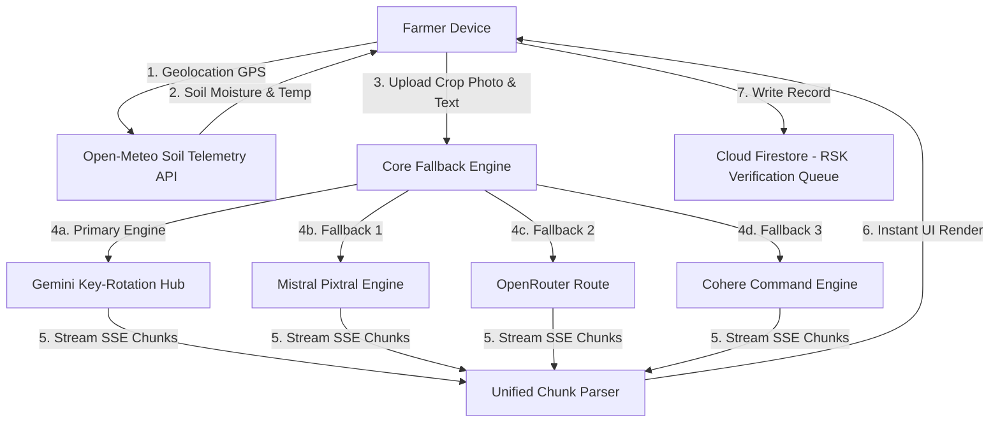

# Kisan Alert Engine (Multilingual AI Soil Telemetry & Farmer Advisories)

Kisan Alert Web is a state-of-the-art agricultural diagnostic portal engineered to assist farmers in real-time. By combining precise meteorological soil telemetry with a multilingual, multimodal AI[...]

## 👥 Engine Developers & Academic Credentials

This application was designed and developed as an academic project by:

*   **Rehan Ansari** (SE Student, Computer Engineering)
    *   *Core Focus:* Designed the AI backend logic, unified SSE streaming rotation engine, key-rotation fallback middleware, and Firebase/Firestore database integration.
*   **Anish Wani** (SE Student, Information Technology)
    *   *Core Focus:* Developed the geological location mapping (GPS) services, Open-Meteo soil telemetry dashboard integration, and responsive layout styling.

---

## 🚀 Key Features

### 1. Real-Time Geological Soil Telemetry
The portal tracks the farmer's live coordinates (via browser GPS or network IP lookup fallbacks) and queries meteorological sensors from the **Open-Meteo API**. It displays:
*   **Soil Moisture** at a root depth of 3-9cm (in m³/m³)
*   **Soil Temperature** at a depth of 6cm (in °C)
*   **Daily Max Air Temperature** (in °C)

### 2. Conversational Multimodal Chat Interface
Farmers can submit queries via three modalities:
*   **Camera Capture:** Open the mobile camera directly to take a live photo of a diseased crop leaf or soil patch.
*   **Photo Library:** Select an existing photo from the device album.
*   **Written Details:** Type text concerns directly into the input container.
The portal renders the response in a conversational thread matching standard chatbot interfaces (Gemini/ChatGPT style).

### 3. Fail-Safe Key Rotation & API Fallback Engine
To prevent downtime from rate limits (HTTP 429) or exhausted developer credits, the application executes a cascading fallback sequence:
1.  **Primary:** Google Gemini-2.5-Flash (rotated across multiple API keys).
2.  **Secondary Fallback:** Mistral AI (using `pixtral-12b`).
3.  **Tertiary Fallback:** OpenRouter (routing `google/gemini-2.5-flash`).
4.  **Quaternary Fallback:** Cohere AI (using `command-a-03-2025`).

### 4. Real-Time SSE Stream Parsing
Features high-performance Server-Sent Events (SSE) stream decoding. As chunks of advisory text flow from the active AI provider, the web client renders the text instantly to ensure zero perceived [...]

### 5. Multilingual Localization
To assist low-literacy users in diverse agricultural belts, the entire portal adjusts to several regional dialects:
*   English
*   Hindi (हिन्दी - Kisan Mitra)
*   Marathi (मराठी - Shetkari Mitra)
*   Tamil (தமிழ் - Farmer Friend)
*   Telugu (తెలుగు - Farmer Friend)

### 6. Cloud Verification Pipeline
Every diagnostic query, uploaded snapshot, and meteorological telemetry payload is written directly to **Cloud Firestore**. This links farmers directly to Rythu Seva Kendra (RSK) experts for offli[...]

---

## 🛠️ Tech Stack & Dependencies

*   **Frontend Core:** React.js (v18.3), Vite (v5.3) for lightning-fast HMR builds.
*   **Styling System:** TailwindCSS (v3.4), custom Vanilla CSS variables for premium glassmorphic cards, modern typography (Outfit & Inter fonts), hover micro-animations, and custom scrolling cont[...]
*   **AI Integration & Parser:** Direct HTTP stream readers using Web streams APIs (`ReadableStreamDefaultReader` and `TextDecoder`) to handle SSE streams from Gemini, Mistral, OpenRouter, and Coh[...]
*   **Database:** Firebase Firestore (Cloud SDK v10.12).
*   **Icons Library:** Lucide-React.

---

## 📁 System Architecture



---

## 🔧 Installation & Local Setup

Follow these instructions to run the project locally on your system:

### Prerequisite: Node.js
Ensure you have **Node.js (v18 or higher)** installed on your device.

### 1. Clone the repository
Extract the project contents to a directory of your choice.

### 2. Configure Environment Variables
Create a file named `.env` in the root directory and specify the API keys for the fallbacks:
```env
# Google AI Studio API Keys (comma-separated for rotation)
VITE_GEMINI_API_KEYS=key1,key2

# Fallback Credentials
VITE_MISTRAL_API_KEY=your_mistral_key_here
VITE_OPENROUTER_API_KEY=your_openrouter_key_here
VITE_COHERE_API_KEY=your_cohere_key_here
```

### 3. Install Dependencies
Run the install command:
```bash
npm install
```

### 4. Launch Development Server
Start the local server:
```bash
npm run dev
```
Open **[http://localhost:5173](http://localhost:5173)** in your browser to test the local build.

### 5. Build for Production
To bundle the assets for static hosting:
```bash
npm run build
```

---

## ☁️ Deployment

The application compiles to a static single-page application (SPA) and supports two deployment targets:

### GitHub Pages (Primary)
The repository includes a GitHub Actions workflow (`.github/workflows/deploy.yml`) that automatically builds and deploys the application on every push to `main`.
*   *Workflow:* Installs dependencies → Builds with Vite → Uploads `dist/` → Deploys to GitHub Pages
*   *Live GitHub Pages URL:* **[https://rehan-1002.github.io/Kisan-Alert-Engine/](https://rehan-1002.github.io/Kisan-Alert-Engine/)**

> **Note:** The `base` property in `vite.config.js` is set to `/Kisan-Alert-Engine/` to support the GitHub Pages sub-path. In your repository Settings → Pages, set the Source to **GitHub Action[...]

### Vercel (Secondary)
*   *Vercel CLI Command:* `vercel --prod`
*   *Live Production URL:* **[https://kisan-alert-web.vercel.app](https://kisan-alert-web.vercel.app)**
